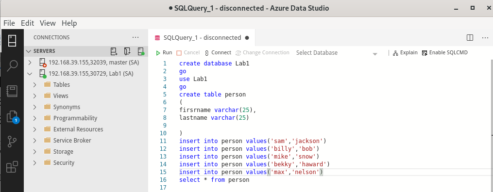

# Getting-Started-with-SQL-Server-and-Kubernetes

For this exercise we are going to use signle node cluster (Minikube). To start we are going to create following components. 

- **A Persisted Disk**

	* Inherently containers have no persisted storage. Obviously, this is a problem for database containers. We are going to define a persistent volume claim to map our storage account.

- **A Deployment**

	* This refers to our container and volume. You will see this defined in the code below.

- **A Service**

	* We will expose our deployment by using a service as NodePort

# Let’s Start

Make sure that you have minikube up and running. If you do not have minikube follow this link to install minikube on you system. Linux machine with Minikube [Install Minikube](https://github.com/salman-mukhtar/setting-up-kubernetes-environment/blob/master/README.md)

To start minikube use following command


```
[mesalman@salmanpc ~]$ minikube start
😄  minikube v1.10.1 on Fedora 32
✨  Using the kvm2 driver based on existing profile
👍  Starting control plane node minikube in cluster minikube
🔄  Restarting existing kvm2 VM for "minikube" ...
🐳  Preparing Kubernetes v1.18.2 on Docker 19.03.8 ...
🌟  Enabled addons: default-storageclass, storage-provisioner
🏄  Done! kubectl is now configured to use "minikube"
[mesalman@salmanpc ~]$  
```


The first thing you’re going to do is build a secret to pass into your deployment, for your SA password.

```
kubectl create secret generic mssql --from-literal=SA_PASSWORD="YourPassword"
```

The next thing we are going to do is build you persistent volume claim.

```
apiVersion: v1 
kind: PersistentVolumeClaim 
metadata: 
  name: "pvc0001" 
spec: 
  accessModes: 
  - "ReadWriteOnce" 
  resources: 
    requests: 
      storage: "5Gi"
```

We will save this text in a file. For the purposes of this posts, we will call it **01-mssql-pvc.yaml**. We will then run the following command. 

```
kubectl apply -f 01-mssql-pvc.yaml
```
You will see the message “persistentvolumeclaim “mssql-data-claim” created.

Next we are going to build our deployment

```
apiVersion: apps/v1
kind: Deployment
metadata:
  name: mssql-deployment
spec:
  selector:
    matchLabels:
      app: mssql
  replicas: 1
  template:
    metadata:
      labels:
        app: mssql
    spec:
      terminationGracePeriodSeconds: 10
      containers:
      - name: mssql
        image: mcr.microsoft.com/mssql/server:2017-latest
        ports:
        - containerPort: 1433
        env:
        - name: ACCEPT_EULA
          value: "Y"
        - name: SA_PASSWORD
          valueFrom:
            secretKeyRef:
              name: mssql
              key: SA_PASSWORD
        volumeMounts:
        - name: mssqldb
          mountPath: /var/opt/mssql
      volumes:
      - name: mssqldb
        persistentVolumeClaim:
          claimName: pvc0001
```

we are defining our deployment, which specifies the container we’re going to use, which in this case it is the latest release of **SQL Server 2017**, and it picks up our predefined SA password. Finally, we are defining our volume mount and its path for where it will be mounted in the VM. Save this off to a file called **02-deployment.yaml**. We will run the following command to deploy this. You will see deployment “mssql-deployment” created.

```
kubectl apply -f deployment.yaml
```

Last but not the least we will expose our deployment as NodePort service. Save the following code as **03-mssql-service.yaml**. 


```
apiVersion: v1
kind: Service
metadata:
  name: mssql-deployment
spec:
  selector:
    app: mssql
  ports:
    - protocol: TCP
      port: 1433
      targetPort: 1433
  type: NodePort

```

and execute it on terminal as

```
kubectl apply -f 03-mssql-service.yaml
```

After the service is exposed run the following command.

```
minikube service mssql-deployment --url
```

The output will give you the IP address and port you can connect to.

> **_Important:_**
> Here you can see that the IP and port are listed as 192.168.39.155:30729
> Make sure to use a comma(,) When you connect to SQL server by using the ip and port like this >  192.168.39.155,30729


|  |
| ------------------------------------------------------------------- |


**SQL Script**

```
create database Lab1
go
use Lab1
go
create table person
(
firsrname varchar(25),
lastname varchar(25)

)
insert into person values('salman','mukhtar')
insert into person values('kamran','azeem')
insert into person values('yasir','abbasi')
insert into person values('khalid','hameed')
insert into person values('shahid','hussain')
select * from person
```

|  |
| ------------------------------------------------------------------- |

|  |
| ------------------------------------------------------------------- |
